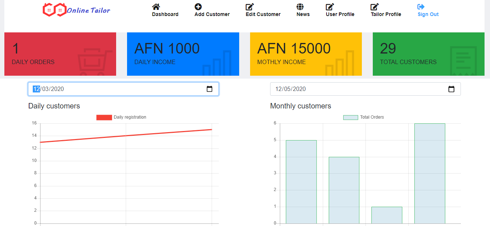

# Online Tailors
The Online Tailors app is a modern web base app written in html, css, javascript and php.
The app provides standard functionality for the customers and the tailors.

Online Tailor ships regularly with new features and bug fixes. You can get the latest version of application from here.


  

  

## Features
- Online Tailors functionality which offers basic operations and evaluates commands immediately as they are entered.
- Scientific Calculator functionality which offers expanded operations and evaluates commands using order of operations.
- Calculation history and memory capabilities.
- Register tailor shops and owners.
- Register customers, see and edit their information.
- View other tailors customers information for future uses.
- daily, weekly and monthly report.
- various more functionality.

## Getting started
Prerequisites:
- install any web server.
- import the sql file.
- run from the local host.


- Get the code:
    ```
    git clone https://github.com/Fazlullahmamond/Online-Tailors.git
    ```

## License
Copyright (c) Mamond. All rights reserved.
